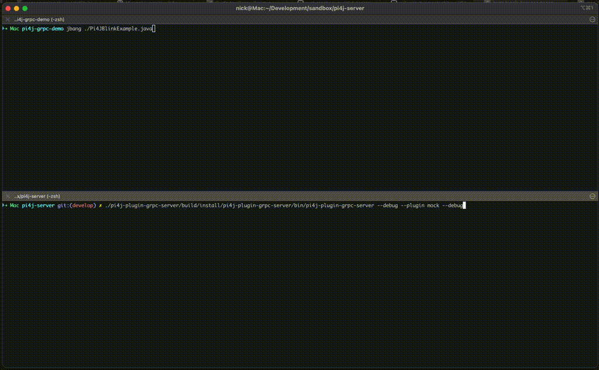

2025-02-11 by I Am Nicknack

Developing for the Raspberry Pi can present challenges:

* **Do you develop on the actual device or write code locally and transfer artefacts to the device?**
* **How do you debug application code?** Should you run locally with the mock provider or on the device with real 
hardware but also have to configure and integrate with a remote debugger?
* **How do you share code between the device and the host?** Should you use a network file system, a shared folder 
or an intermediate repository?

All of the above and more are possible, but all of them require effort, compromise and additional complications to 
the toolchain that we would probably rather avoid.

Up until the Raspberry Pi 5, [pigpiod](https://abyz.me.uk/rpi/pigpio/pigpiod.html) provided a solution. 
This was a third-party native daemon which could be used together with a set of Pi4J providers to gain remote 
access to GPIO, SPI, i2c, etc. Thanks to high-level abstractions, the providers could run locally and communicate 
with the daemon via a network socket, and the daemon would then forward the calls to the actual hardware.

However, due to hardware changes in the Raspberry Pi 5, this solution is no longer available and Pi4J needs a 
replacement. Funnily enough, Pi4J already provides its own hardware integration, so all that's really required are 
client and service layers on top of this.

## pi4j-plugin-grpc

The gRCP plugin fills the gap created by the lack of pigpiod and comprises two parts:

* A gRPC server which runs on the device and provides the Pi4J service layer
* A gRPC provider which connects to the gRPC server and forwards calls to the actual hardware

With a server running on a Raspberry Pi and access to IO devices, application development can be done locally, 
with no compromises to the toolchain.

## Getting started

At the time of writing, the gRPC components are in pre-release and not yet available on Maven Central. The 
simplest way to get started is to clone the repository and build the plugin locally. So .... 

### Building from source

```shell
git clone git clone https://github.com/IAmNickNack/pi4j-plugin-grpc.git
cd pi4j-plugin-grpc

# Build and install the plugin to the local Maven repository:
./gradlew :pi4j-plugin-grpc:publishToMavenLocal

# Build and install the server distribution:
./gradlew :pi4j-plugin-grpc-server:installDist

# Output the current build version:
./gradlew :pi4j-plugin-grpc:properties -q | grep "version:"
```

### Referencing the plugin in your project

The build described above results in the plugin being installed in the local Maven repository and allows you to 
reference it in your build configuration in the usual way. Be sure to use the correct version number, as shown in 
the output of the `properties` task. 

For example, in Maven:
```xml
<dependency>
    <groupId>com.github.iannicknack.pi4j</groupId>
    <artifactId>pi4j-plugin-grpc</artifactId>
    <version>0.0.1-SNAPSHOT</version>
</dependency>
```
or Gradle:
```kotlin
implementation("com.github.iannicknack.pi4j:pi4j-plugin-grpc:0.0.1-SNAPSHOT")
```

### Running the server

The build also installs a server distribution to the `./pi4j-plugin-grpc-server/build/install/pi4j-plugin-grpc-server` 
directory and contains a `bin/pi4j-plugin-grpc-server` script which can be used to start the server.

```bash
./pi4j-plugin-grpc-server/build/install/pi4j-plugin-grpc-server/bin/pi4j-plugin-grpc-server
``` 

Running this command with no arguments will start the server on port `9090`. 

If running on a Raspberry Pi, Pi4J will default to the FFM provider (`pi4j-plugin-ffm`). However, platforms without 
IO access will default to the mock provider (`pi4j-plugin-mock`).

This behaviour can be overridden with additional command line arguments:

## Next steps

The next steps are virtually the same as any other Pi4J application: Add the plugin to your build configuration and 
start writing code. The only slight difference here is that we need to tell the gRCP provider where to connect to. 
Without connection details, the provider will not configure and the provider of the next priority will be loaded
by Pi4J.

### Configuration 

Two properties are required in order for the provider to load:
* `pi4j.grpc.host`: the host name or IP address of the gRPC server
* `pi4j.grpc.port`: the port on which the gRPC server is listening

When providing these values as system properties, system properties need to be added to the Pi4J context:

```java
var pi4j = Pi4J.newContextBuilder()
        .properties(System.getProperties())
        .autoDetect()
        .build();
```

Similarly, they also need to be added to the context if they are being provided by other application code:

```java
var pi4j = Pi4J.newContextBuilder()
        .property("pi4j.grpc.host", "localhost")
        .property("pi4j.grpc.port", "9090")
        .autoDetect()
        .build();
```

As mentioned earlier, the gRPC provider does not assume any default values. Without these properties, the provider 
will not configure and the provider of the next priority will be loaded.

### JBang Example

Firstly, we'll start the server locally, without hardware integration, using the Pi4J mock provider with debug enabled
to see what's happening:

```shell
./pi4j-plugin-grpc-server/build/install/pi4j-plugin-grpc-server/bin/pi4j-plugin-grpc-server --plugin mock --debug
```

Then, let's create a simple JBang script called `Pi4JBlinkExample.java` to test the connection:

```java
///usr/bin/env jbang "$0" "$@" ; exit $?

//DEPS org.slf4j:slf4j-simple:2.0.17
//DEPS io.github.iamnicknack.pi4j:pi4j-plugin-grpc:0.0.1-SNAPSHOT
//JAVA_OPTIONS -Dpi4j.grpc.host=localhost -Dpi4j.grpc.port=9090

import com.pi4j.Pi4J;
import com.pi4j.io.gpio.digital.DigitalOutput;
import com.pi4j.io.gpio.digital.DigitalState;

public class Pi4JBlinkExample {

    private static final int PIN_LED = 5;

    public static void main(String[] args) throws Exception {

        var pi4j = Pi4J.newContextBuilder()
                .properties(System.getProperties())
                .autoDetect()
                .build();

        var outputConfig = DigitalOutput.newConfigBuilder(pi4j)
                .id("led")
                .name("Blinker")
                .address(PIN_LED)
                .shutdown(DigitalState.LOW)
                .initial(DigitalState.LOW);
        
        var output = pi4j.create(outputConfig);

        output.addListener(event -> System.out.println("Output state changed: " + event.state()));
        
        for (int i = 0; i < 10; i++) {
            output.high();
            Thread.sleep(500);
            output.low();
            Thread.sleep(500);
        }

        pi4j.shutdown();
    }
}
```

And finally, run the script:

```shell
jbang Pi4JBlinkExample.java
```


